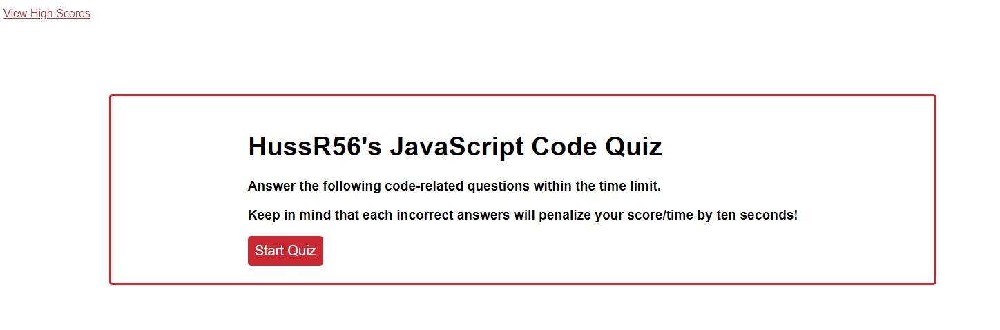

# JavaScript-Fundamentals-Quiz

For this week's assignment I created a quiz website using JavaScript, CSS, and HTML. The quiz that was created is time and it keeps track of the high scores. 

## Action Taken:
* Created two different HTMLs, one for actual site and one for the high score site. 
* Created two different JavaScript pages one for the quiz questions and one for the high scores.
* Using JavaScript I was able to create variables and arrays for the variables.
* Used fuNctions for the quiz questions, options, correct answers, and the timer.
* Used the "if/else" statements for the answer options against the right answers.
* Used additional varIables and event listener to respond to the user "clicks".
* Used "Stringify" for storing and pulling the high scores and initials.

Screenshot:

     
 

URL: https://hussrizk56.github.io/JavaScript-Fundamentals-Quiz/
